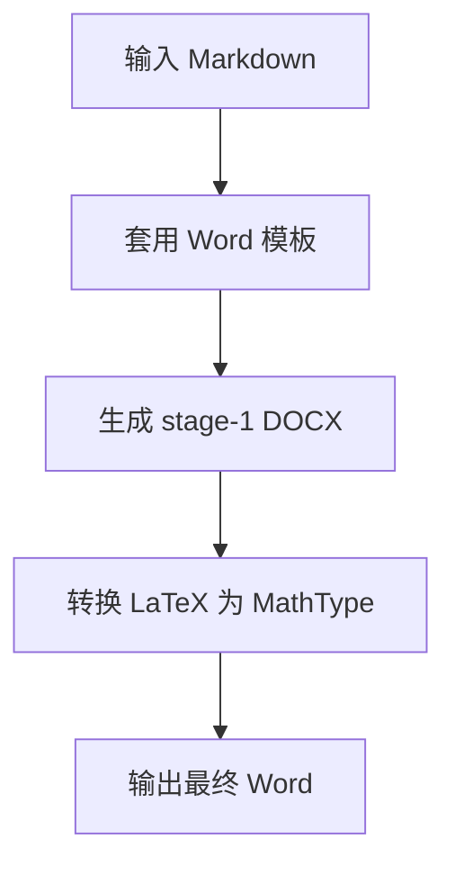
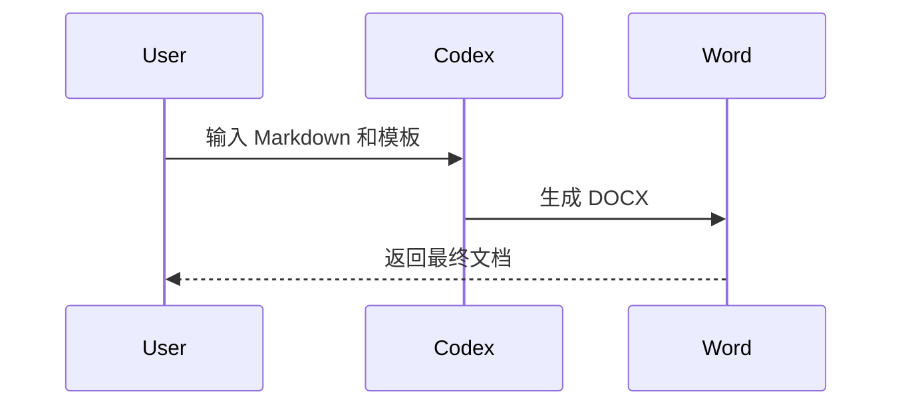

# 一级标题：Markdown 转 Word 模板测试

这是一级标题下的正文段落，用于测试普通正文、中文标点、英文术语和行内公式的混排效果。本文档可用于验证 `md-to-template-docx` 与 `word-mathtype-selective` 的完整转换链路。

行内公式测试：目标函数记为 $f(x)=x^2+2x+1$，输入向量满足 $\mathbf{x}\in\mathbb{R}^{d}$，分类概率满足 $p_i \in [0,1]$。

## 二级标题：基础正文与公式

这一节用于测试二级标题映射到 Word 的 `Heading 2` 样式。正文中包含加粗、列表、内联代码和公式。

- 第一项：测试普通项目符号。
- 第二项：测试行内公式 $E = mc^2$。
- 第三项：测试英文缩写，如 CNN、Transformer、MathType。

### 三级标题：行间公式

下面是一个行间公式，stage-1 阶段应保留为 LaTeX 源码，stage-2 阶段应转换为 MathType display 公式：

\[
L(\theta)=\frac{1}{N}\sum_{i=1}^{N}\left(y_i-\hat{y}_i\right)^2+\lambda\lVert\theta\rVert_2^2
\]

另一个包含空心集合符号和维度上标的公式：

\[
F_{\text{enc}}\in\mathbb{R}^{\frac{H}{32}\times\frac{W}{32}\times C}
\]

## 二级标题：表格测试

表1 测试指标对比

| 指标 | 方法A | 方法B | 说明 |
| --- | ---: | ---: | --- |
| Precision | 0.912 | 0.936 | 精确率 |
| Recall | 0.884 | 0.901 | 召回率 |
| F1-score | 0.898 | 0.918 | 综合指标 |

表格上方的“表1 测试指标对比”应转换为 Word `Caption` 样式，并使用 `SEQ 表` 自动编号域。表格本体应转换为三线表。

## 二级标题：Mermaid 绘图测试

图1 数据处理流程

上面的 Mermaid 图在 stage-1 阶段不应被渲染为位图，而应替换为 `[VISIO:diagram-01]` 占位，同时在旁边生成 `.mmd` 源文件和 `manifest.json`。

### 三级标题：图题占位测试

下面的 Mermaid 图没有显式图题，转换后应自动插入“图N 请填写图题”占位。

## 二级标题：混合内容测试

这一节包含正文、内联公式、行间公式和表格，用于观察转换后的段落间距、公式行高和 MathType 对象是否完整。

给定查询特征 $\mathbf{q}_i$ 和键特征 $\mathbf{k}_j$，注意力权重定义为：

\[
\alpha_{ij}=\frac{\exp\left(\mathbf{q}_i^\top\mathbf{k}_j/\sqrt{d}\right)}
{\sum_{m=1}^{M}\exp\left(\mathbf{q}_i^\top\mathbf{k}_m/\sqrt{d}\right)}
\]

最终输出为 $ \mathbf{o}_i=\sum_{j=1}^{M}\alpha_{ij}\mathbf{v}_j $。这里故意保留一个包含空格的行内公式，用于测试脚本对行内公式边界的处理。

## 二级标题：结束语

如果转换正确，最终 Word 文档应满足：

1. 一级、二级、三级标题分别映射到 Word 对应标题样式；
2. 正文样式来自模板；
3. Markdown 表格转换为三线表；
4. Mermaid 代码块转换为 Visio 占位；
5. 行内公式和行间公式均转换为 MathType 对象；
6. 图题和表题使用 Word `Caption` 样式和自动编号域。

